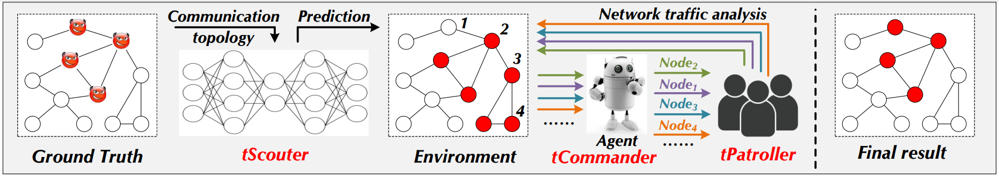
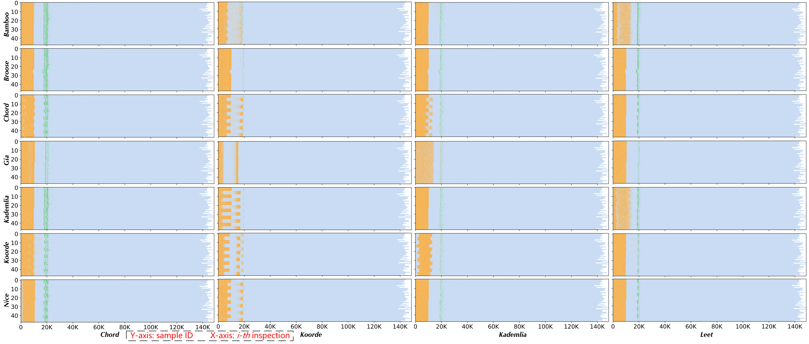
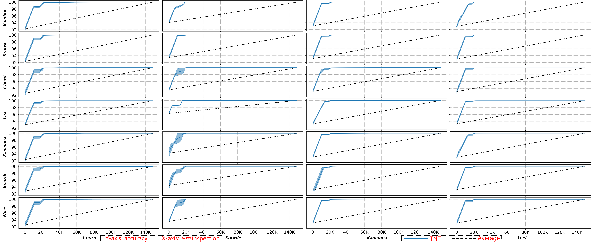
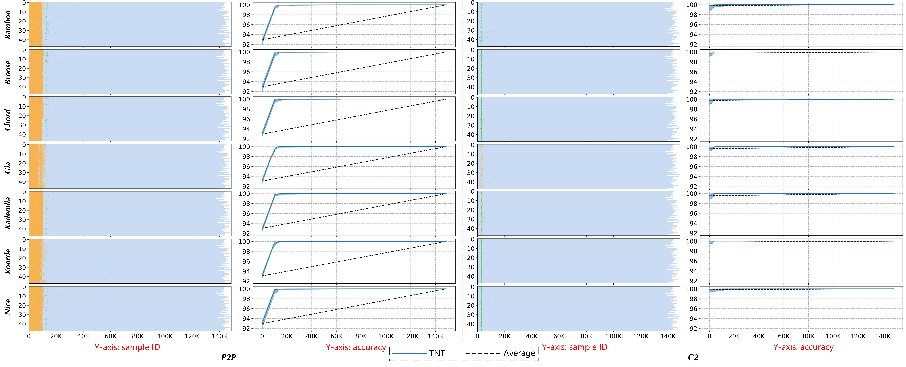

### 💣 TNT: A Large-Scale P2P Botnet Detection Framework via Communication Topology and Network Traffic



## Introduction

TNT is a detection framework for large-scale P2P botnet that combining communication topology and network traffic. TNT includes three tightly-coupled components: (i) tScouter is responsible for profiling the communication topology; (ii) tCommander plans the strategy for node inspection; and (iii) tPatroller investigates the traffic of the corresponding node. Taken together, TNT advances the trade-off between detection effect and overhead. This repository displays the corresponding source code for model implementation, as well as dataset. 

## Requirements

```bash
pip install numpy
pip install pandas
pip install tqdm
pip install pyecharts
pip install pickle
pip install torch
```

## Dataset
We utilize OMNet simulation to generate traffic for 7 common P2P protocols, includig 'Bamboo', 'Broose', 'Chord', 'Gia', 'Kademlia', 'Koorde', 'Nice'. 
The ./dataset/ folder stores the graph instance of each-type P2P protocol. We will put the entire dataset on the cloud disk. 

## Model 

The 'Agent' is defined in ./model/rl_agent.py.

The environment and rewards are implemented in ./model/graph_rl.py.

The main function is stored in ./model/run_rl.py.
```bash
python run_rl.py
```

## Evaluation

Some additional evaluation results are stored in the ./evaluation/ folder. 

A series of strategies visualization and accuracy growth curves for various topology combinations.







### References
- [Kitsune: An Ensemble of Autoencoders for Online Network Intrusion Detection](https://arxiv.org/abs/1802.09089), Yisroel Mirsky, Tomer Doitshman, Yuval Elovici, Asaf Shabtai - NDSS 2018
- [Realtime Robust Malicious Traffic Detection via Frequency Domain Analysis](https://dl.acm.org/doi/10.1145/3460120.3484585), Chuanpu Fu, Qi Li, Meng Shen, Ke Xu - CCS 2021
- [ERNN: Error-Resilient RNN for Encrypted Traffic Detection towards Network-Induced Phenomena](https://ieeexplore.ieee.org/document/10036003), Ziming Zhao, Zhaoxuan Li, Jialun Jiang, Fengyuan Yu, Fan Zhang, Congyuan Xu, Xinjie Zhao, Rui Zhang, Shize Guo - TDSC 2023
- [CMD: Co-analyzed IoT Malware Detection and Forensics via Network and Hardware Domains](https://ieeexplore.ieee.org/abstract/document/10237298/), Ziming Zhao, Zhaoxuan Li, Jiongchi Yu, Fan Zhang, Xiaofei Xie, Haitao Xu, Binbin Chen - TMC 2023
- [ET-BERT: A Contextualized Datagram Representation with Pre-training Transformers for Encrypted Traffic Classification](https://dl.acm.org/doi/10.1145/3485447.3512217), Xinjie Lin, Gang Xiong, Gaopeng Gou, Zhen Li, Junzheng Shi, Jing Yu - WWW 2022
- [FS-Net: A Flow Sequence Network For Encrypted Traffic Classification](https://ieeexplore.ieee.org/document/8737507), Chang Liu, Longtao He, Gang Xiong, Zigang Cao, and Zhen Li - INFOCOM 2019
- [ProGraph: Robust Network Traffic Identification With Graph Propagation](https://ieeexplore.ieee.org/abstract/document/9933044/), Wenhao Li, Xiao-Yu Zhang, Huaifeng Bao, Haichao Shi, Qiang Wang - TON 2023
- [Attention-based deep multiple instance learning](https://proceedings.mlr.press/v80/ilse18a.html?ref=https://githubhelp.com), Maximilian Ilse, Jakub Tomczak, Max Welling - ICML 2018
- [Automating Botnet Detection with Graph Neural Networks](https://arxiv.org/abs/2003.06344), Jiawei Zhou, Zhiying Xu, Alexander M. Rush, and Minlan Yu - arXiv 2020
